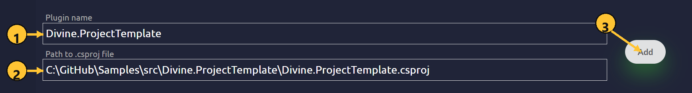
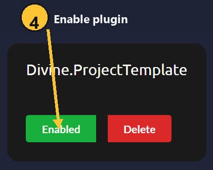

# Getting Started

## Local plugins

Follow these steps to create, add, build, and reload a local Divine plugin.

### Step 1. Install the required tools

Install the required development tools:

- [.NET 10 SDK](https://dotnet.microsoft.com/download/dotnet/10.0)
- [Visual Studio 2022 or Visual Studio 2026](https://visualstudio.microsoft.com/downloads/) with a .NET development workload, or [JetBrains Rider](https://www.jetbrains.com/rider/download/)

### Step 2. Create a plugin project

Use the sample plugin project template from GitHub:

[DivinePlugins/Samples](https://github.com/DivinePlugins/Samples)

Clone the repository and open the solution or project `.csproj` in Visual Studio or Rider.

### Step 3. Check the project files

The project must include a `global.json` file:

```json
{
  "sdk": {
    "version": "10.0.400",
    "rollForward": "disable"
  },
  "msbuild-sdks": {
    "Divine.Sdk": "1.6.0"
  }
}
```

The plugin `.csproj` file must use `Divine.Sdk`:

```xml
<Project Sdk="Divine.Sdk" />
```

### Step 4. Add the plugin in Divine

Open the local plugins page:

[https://divine.wtf/local-plugins](https://divine.wtf/local-plugins)

Fill in the form:

- `Plugin name`: the plugin name shown in the local plugins list.
- `Path to .csproj file`: the full path to the plugin `.csproj` file.



Click `Add`.

### Step 5. Enable the plugin

After the plugin is added, it appears in the local plugins list.

Click the plugin status button so it shows `Enabled`.



### Step 6. Build the plugin

Build the plugin project in Visual Studio or Rider.

Wait until the build finishes successfully.

### Step 7. Reload the plugin in game

After the build succeeds, go back to the game and press `F5` to reload local plugins.

If the plugin is enabled and the build output is valid, Divine loads the updated plugin build.
